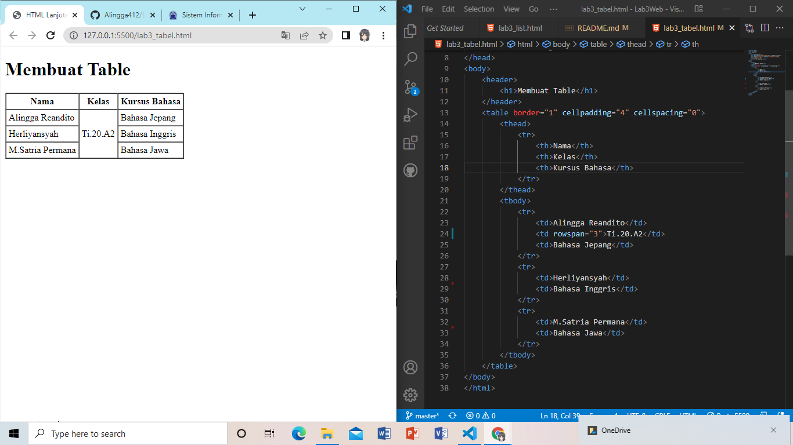

# Tugas Lab 3 Web
## Profil
| # | Biodata |
| -------- | --- |
| **Nama** | Alingga Reandito |
| **NIM** | 312010276 |
| **Kelas** | TI.20.A.2 |
| **Mata Kuliah** | Pemrograman Web |
## Langkah 1

### 1. Membuat Ordered List
```html
<header>
        <h1>Membuat List</h1>
    </header>
    <section id="order-list">
        <h2>Ordered List</h2>
        <ol>
            <li>Pemrograman web</li>
            <li>Sistem Informasi</li>
            <li>Basis Data 2</li>
        </ol>
    </section>
```


### 2. Membuat Unordered List
```html
<section id="unorder-list">
    <h2>Unordered List</h2>
        <ul type="square">
            <li>Bahasa Inggris</li>
            <li>Bahasa Jepang</li>
            <li>Bahasa Jawa</li>
        </ul>
</section>
```


### 3. Membuat Description List
```html
<section id="unorder-list">
    <h2>Description List</h2>
    <dl>
        <dt>Fakultas Teknik</dt>
        <dd>Teknik Industri</dd>
        <dd>Teknik Informatika</dd>
        <dd>Teknik Lingkungan</dd>
        <dt>Fakultas Ekonomi dan Bisnis</dt>
        <dd>Akuntansi</dd>
        <dd>Manajemen</dd>
        <dd>Bisnis Digital</dd>
    </dl>
</section>
```


### 4. Membuat Tabel
```html
<header>
        <h1>Membuat Table</h1>
    </header>
    <table border="2" cellpadding="5" cellspacing="1">
        <thead>
            <tr>
                <th>Nama</th>
                <th>Kelas</th>
                <th>Kursus Bahasa</th>
            </tr>
        </thead>
        <tbody>
            <tr>
                <td>Alingga Reandito</td>
                <td>Ti.20.A2</td>
                <td>Bahasa Jepang</td>
            </tr>
            <tr>
                <td>Herliyansyah</td>
                <td>Ti.20.A2</td>
                <td>Bahasa Inggris</td>
            </tr>
            <tr>
                <td>M.Satria Permana</td>
                <td>Ti.20.A2</td>
                <td>Bahasa Jawa</td>
            </tr>
        </tbody>
    </table>
```


### 5. Mengatur Margin dan Padding
```html
<table border="1" cellpadding="4" cellspacing="0">
```


### 6. Menggabungkan Sel data
```html
<table border="1" cellpadding="4" cellspacing="0">
        <thead>
            <tr>
                <th>Nama</th>
                <th>Kelas</th>
                <th>Kursus Bahasa</th>
            </tr>
        </thead>
        <tbody>
            <tr>
                <td>Alingga Reandito</td>
                <td rowspan="3">Ti.20.A2</td>
                <td>Bahasa Jepang</td>
            </tr>
            <tr>
                <td>Herliyansyah</td>
                <td>Bahasa Inggris</td>
            </tr>
            <tr>
                <td>M.Satria Permana</td>
                <td>Bahasa Jawa</td>
            </tr>
        </tbody>
    </table>
```



### 7. Membuat Form
```html
<form action="proses.php" method="post">
    <fieldset>
        <legend>Data Pelanggan</legend>
        <p>
            <label for="nama">Nama</label>
            <input type="text" id="nama" name="nama">
        </p>
        <p>
            <label for="alamat">Alamat</label>
            <textarea name="alamat" id="alamat" cols="25" rows="5"></textarea>
        </p>
        <p>
            <label for="#">Jenis Kelamin</label>
            <input id="jk_1" type="radio" name="kelamin" value="L"><label for="jk_1">Laki-Laki</label>
            <input id="jk_2" type="radio" name="kelamin" value="P"><label for="jk_2">Perempuan</label>
        </p>
        <p>
            <input type="Submit" value="Login">
        </p>
    </fieldset>
</form>
```


### 8. Menambahkan Style Pada Form
```html
 